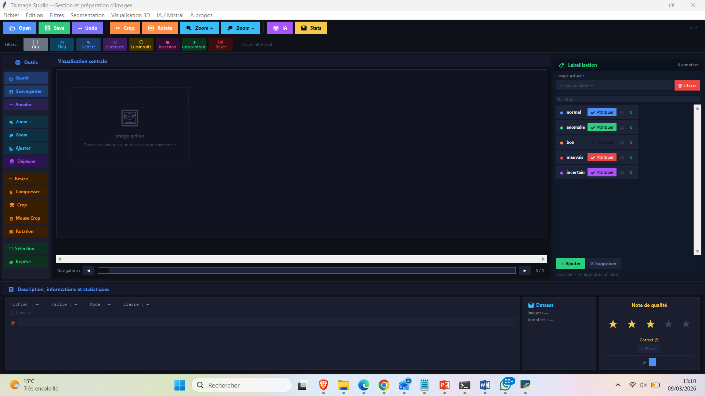
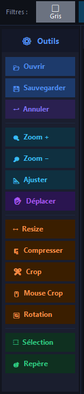

# TkImage Studio — Outil de gestion, annotation et prétraitement d'images pour Machine Learning

[](https://python.org)
[](https://docs.python.org/3/library/tkinter.html)
[](https://pillow.readthedocs.io)
[](LICENSE)
[](https://ensam-umi.ac.ma)

**Une application desktop complète pour la préparation de datasets visuels : visualisation, transformation, annotation, export et assistance IA — le tout dans une interface unifiée.**

---

## Problématique

La préparation des données est l'étape la plus chronophage de tout projet de vision par ordinateur. Elle mobilise habituellement plusieurs outils distincts : un visualiseur pour examiner les images, un éditeur graphique pour les retoucher, des scripts Python pour les convertir, et des tableurs pour gérer les annotations. Cette dispersion multiplie les risques d'erreurs et ralentit considérablement le travail.

**TkImage Studio** centralise toutes ces opérations au sein d'une interface unique, pensée pour les praticiens du machine learning.

---

## Fonctionnalités

**Gestion des fichiers et navigation**
- Ouverture d'une image unique ou d'un dossier entier (jusqu'à 500 images testées, chargement en ~2s)
- Navigation par flèches clavier, slider ou miniatures cliquables mises en cache
- Formats supportés : `.jpg`, `.png`, `.bmp` et autres formats PIL

**Visualisation**
- Affichage avec zoom (molette ou boutons), déplacement (pan), adaptation automatique à la fenêtre
- Sélection de région d'intérêt (ROI) directement sur le canvas

**Traitements d'images**

| Catégorie | Opérations disponibles |
|-----------|------------------------|
| Géométrie | Redimensionnement, rotation (90° ou libre), recadrage manuel ou à la souris |
| Filtres | Niveaux de gris, flou gaussien, netteté, contraste, luminosité, inversion, autocontraste |
| Segmentation | Seuillage simple, masque binaire, extraction de ROI |
| Historique | Undo / Redo (`Ctrl+Z` / `Ctrl+Y`) avec pile d'états |

**Annotation et classification**
- Labels personnalisables avec choix de couleur et attribution par touche numérique (1–9)
- Note de qualité sur 5 étoiles et description libre par image
- Compteur d'images par label avec barres de progression visuelles

**Statistiques en temps réel**
- Nombre total d'images, images annotées, répartition par label (nombre et pourcentage)
- Métadonnées EXIF extraites automatiquement (dimensions, mode, taille, date, appareil, ISO)

**Export des annotations**

| Format | Contenu |
|--------|---------|
| JSON | Structure hiérarchique, une entrée par image |
| CSV | Tableau plat compatible Excel — chemin, dimensions, EXIF, label, note, description |

**Visualisation 3D** (via Matplotlib)
- Surface d'intensité, carte thermique (palettes `jet`, `viridis`), empilement de coupes

**Assistant IA — API Mistral**
- Tâches prédéfinies : décrire l'image, suggérer une classe, générer du code de prétraitement, analyser la qualité, générer des annotations COCO, suggérer des augmentations
- Choix du modèle : `mistral-small`, `mistral-medium`, `mistral-large`, `pixtral-12b`
- Appels asynchrones (thread séparé) — l'interface ne se bloque pas
- Bouton "Copier le code" et injection automatique de la classe suggérée

---

## Architecture technique

```
tkimage_studio/
├── main.py                    # Point d'entrée
├── app.py                     # Classe principale App (liaison vue-contrôleur)
├── src/
│   ├── ui/                    # Composants graphiques
│   │   ├── main_window.py
│   │   ├── menu_bar.py
│   │   ├── top_toolbar.py
│   │   ├── left_toolbar.py
│   │   ├── image_viewer.py
│   │   ├── right_panel.py
│   │   ├── label_panel.py
│   │   ├── ia_panel.py
│   │   └── status_panel.py
│   ├── core/                  # Logique métier
│   │   ├── file_manager.py
│   │   ├── image_processor.py
│   │   ├── annotation_manager.py
│   │   └── stats_manager.py
│   └── utils/                 # Constantes, helpers
│       ├── constants.py
│       └── helpers.py
├── assets/                    # Icônes, thèmes
├── data/                      # Images d'entrée / sortie
└── models/                    # Configuration API (api_config.json)
```

Architecture **MVC simplifiée** :
- **Modèle** — traitement d'images, annotations, statistiques (`src/core/`)
- **Vue** — composants Tkinter thème sombre (`src/ui/`)
- **Contrôleur** — `app.py` orchestre les interactions entre les modules

---

## Installation

```bash
# Cloner le dépôt
git clone https://github.com/SouleymaneDiallo04/tkimage-studio.git
cd tkimage-studio

# (Optionnel) Créer un environnement virtuel
python -m venv venv
source venv/bin/activate      # Linux / macOS
venv\Scripts\activate         # Windows

# Installer les dépendances
pip install -r requirements.txt

# Lancer l'application
python main.py
```

> **Note :** L'assistant IA nécessite une clé API Mistral, saisie directement dans le panneau IA au premier lancement. Elle est stockée localement dans `models/api_config.json`.

---

## Utilisation rapide

| Action | Commande |
|--------|----------|
| Ouvrir une image | Bouton Open ou menu Fichier |
| Ouvrir un dossier | Menu Fichier → Ouvrir dossier |
| Naviguer entre images | Flèches `←` `→`, slider ou miniatures |
| Attribuer un label | Touches `1`–`9` ou bouton Attribuer |
| Undo / Redo | `Ctrl+Z` / `Ctrl+Y` |
| Exporter les annotations | Menu Fichier → Exporter JSON / CSV |
| Lancer l'assistant IA | Panneau droit → onglet IA → Générer |

---

## Captures d'écran





---

## Technologies utilisées

| Technologie | Usage |
|-------------|-------|
| Python 3.13 | Langage principal |
| Tkinter | Interface graphique native |
| Pillow (PIL) | Traitement d'images |
| Matplotlib | Visualisation 3D |
| Requests | Appels API Mistral |
| Threading | Appels asynchrones |
| JSON / CSV | Export des annotations |

---

## Performances et limitations

- Réactif sur des images jusqu'à 4000×3000 pixels
- Miniatures mises en cache pour une navigation fluide
- La visualisation 3D peut être lente sur de très grandes images
- La clé API est actuellement stockée en clair (amélioration prévue : variables d'environnement)

---

## Perspectives

- Support vidéo via OpenCV
- Intégration de modèles locaux (TensorFlow Lite, PyTorch Mobile)
- Génération automatique de structures de datasets (YOLO, COCO)
- Partage collaboratif des annotations via serveur
- Thèmes et raccourcis configurables

---

## Auteur

**Souleymane Diallo** — Intelligence Artificielle et Technologies des Données (IATD-SI)  
ENSAM Meknès — Université Moulay Ismaïl · Mars 2026  
Encadrant : Pr. Brahim Bakkas

---

## Licence

Ce projet est distribué sous licence **MIT** — voir le fichier [LICENSE](LICENSE) pour les détails.
